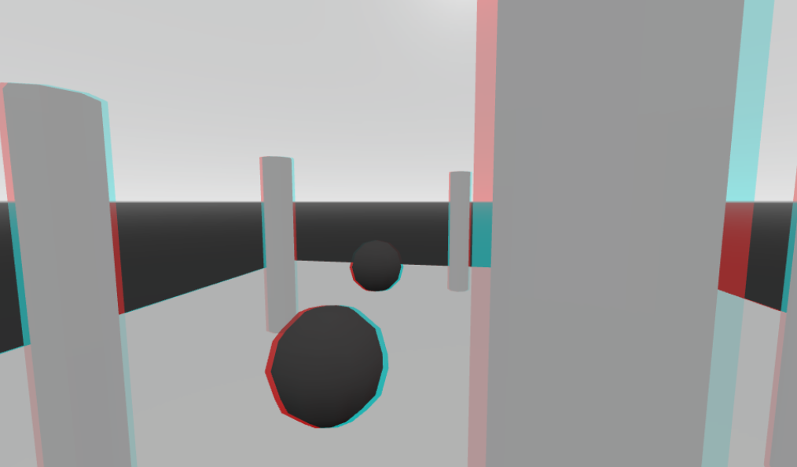

# Godot Anaglyph Camera

This is a simple plugin adds a new Camera called `AnaglyphCamera`. With it, you can make a 3D anaglyph effect in Godot.

## Installation

Whether you downloaded it from GitHub, or from the Godot asset library, you must copy the folder `silicon.3d.anaglyph` from the `addons` folder into your project's `addons` folder. Don't have one? Make one. After that, you must go into your `Project Settings` and enable the addon there.

## Usage

The addon is very to use. Just add a new Camera called `AnaglyphCamera` to the scene. You use just like an ordinary camera, but it has a few new properties.

* `Separation`: How far apart the camera's "eyes" are. Increasing this strengthens the 3D effect.
* `Convergence`: How far the camera's focal point is. This point is where the 3D effect will appear like a regular camera.
* `Greyscale`: How much the view should appear black and white.
* `Half Res`: Whether the camera should be rendered at half resolution. The anaglyph camera renders the scene twice, so increasing this can improve performance.